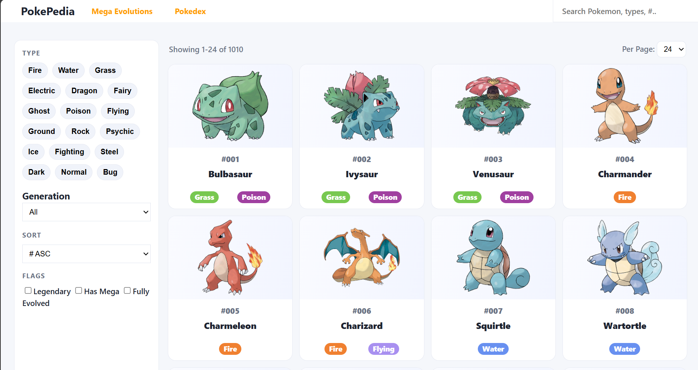
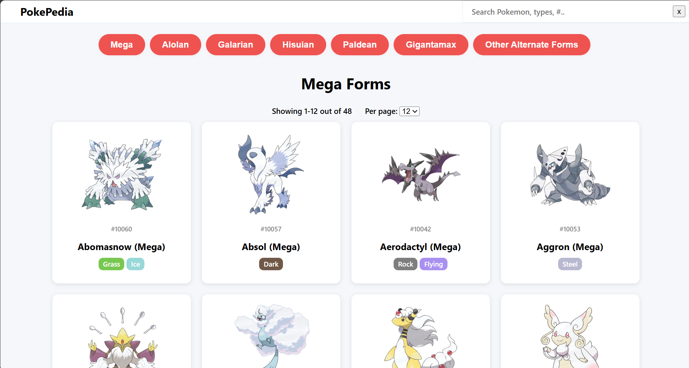
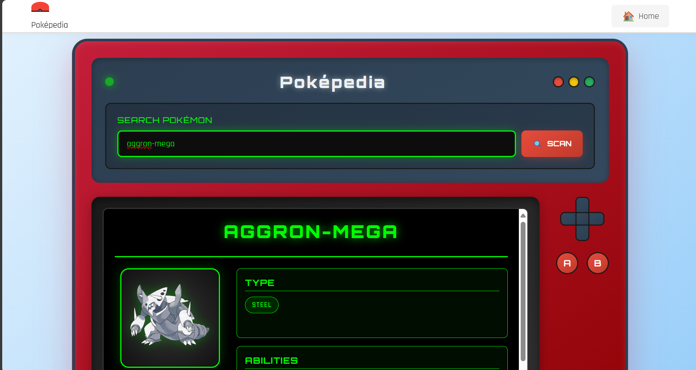

# PokéPedia

A simple **Pokédex clone** built using **HTML, CSS, and JavaScript** with data from the [PokeAPI](https://pokeapi.co/).  
Browse, search, and filter Pokémon by type, region, generation, evolution, and more.  
Includes a separate page for **Mega Evolutions**.

---

## 🚀 Features
- 📜 **All Pokémon** displayed with images, names, and types
- 🔍 **Search** by name or ID
- 🏷️ **Filters** for type, region, generation, and evolutions
- 📊 **Sorting** by name or index
- 🌟 **Mega Evolutions** page
- 📱 Responsive design

---

## 🛠️ Tech Stack
- **Frontend:** HTML, CSS, JavaScript  
- **API:** [PokeAPI](https://pokeapi.co/)  
- **Icons & Styling:** Custom CSS

---

## 📷 Preview

---
